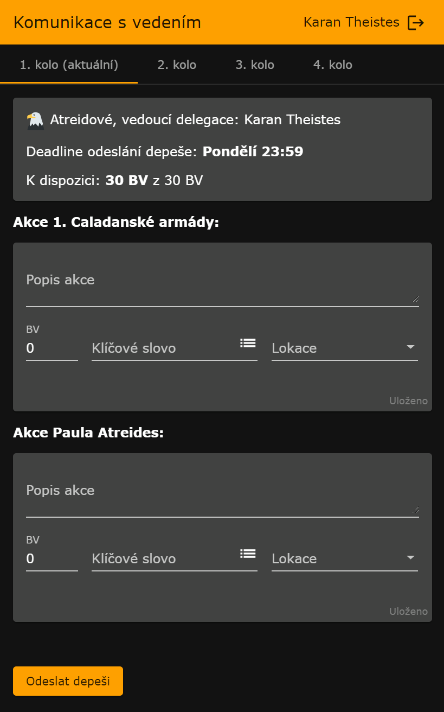

# Duna: Válka Assassinů
Systém pro hráče a organizátory hry Duna: Válka Assassinů. Forknuto ze systému pro larp Konec Dějin 2.0.

## Ukázka

## Technologie
Systém je postaven nad nejnovějším Angularem + Angular Material. Jako backend je Firebase Realtime Database. Kód je v TypeScriptu.
## Contributions
Chcete systém vylepšit? Pošlete pull request! Budu se Vám věnovat.
## Deploy
Push do master větve automaticky deployne projekt přes CircleCI:

